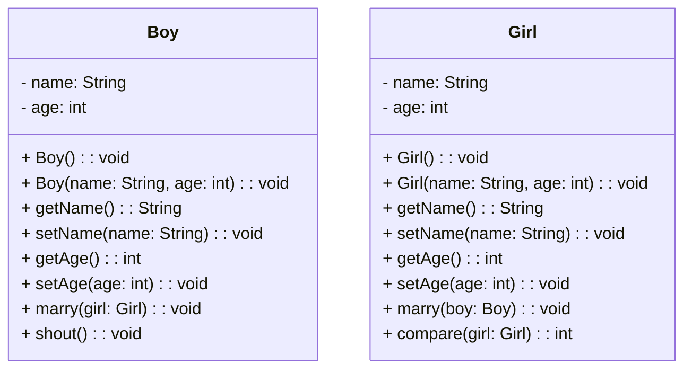

```mermaid
classDiagram
    class Boy {
        - name: String
        - age: int
        + Boy() : void
        + Boy(name: String, age: int) : void
        + getName() : String
        + setName(name: String) : void
        + getAge() : int
        + setAge(age: int) : void
        + marry(girl: Girl) : void
        + shout() : void
    }
    class Girl {
        - name: String
        - age: int
        + Girl() : void
        + Girl(name: String, age: int) : void
        + getName() : String
        + setName(name: String) : void
        + getAge() : int
        + setAge(age: int) : void
        + marry(boy: Boy) : void
        + compare(girl: Girl) : int
    }
```
