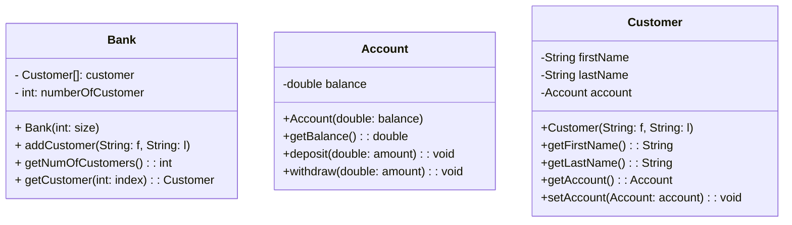

```mermaid
classDiagram
    class Bank {
        - Customer[]: customer
        - int: numberOfCustomer
        + Bank(int: size)
        + addCustomer(String: f, String: l)
        + getNumOfCustomers() : int
        + getCustomer(int: index) : Customer
    }
    
    class Account {
        -double balance
        +Account(double: balance)
        +getBalance() : double
        +deposit(double: amount) : void
        +withdraw(double: amount) : void
    }

    class Customer {
        -String firstName
        -String lastName
        -Account account
        +Customer(String: f, String: l)
        +getFirstName() : String
        +getLastName() : String
        +getAccount() : Account
        +setAccount(Account: account) : void
    }

```

